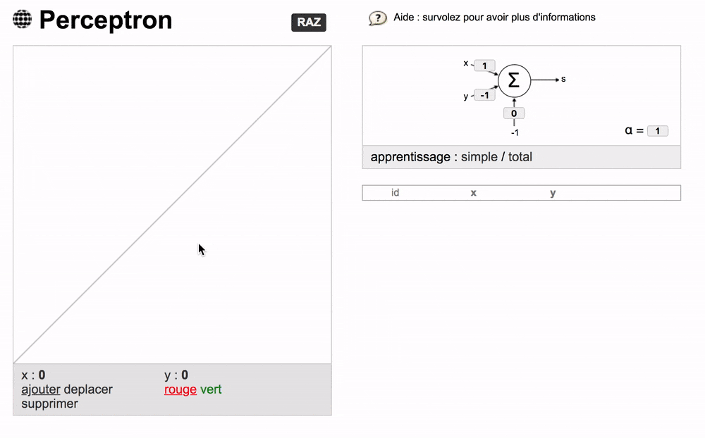

### [Live demo ☞](https://lucleray.github.io/perceptron/)

### About

This project is aimed at explaining and illustrating how [perceptrons](https://en.wikipedia.org/wiki/Perceptron) work (neural networks).

The interface shows, how, step by step, the perceptron is trained against the data points added by the user.

The method used to train the algorithm is called the [gradient descent](https://en.wikipedia.org/wiki/Gradient_descent).

The activation function is the [sigmoid](https://en.wikipedia.org/wiki/Sigmoid_function).

### More

Made in 2013 with [mootools](https://mootools.net/).
